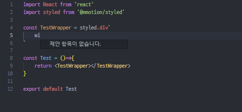
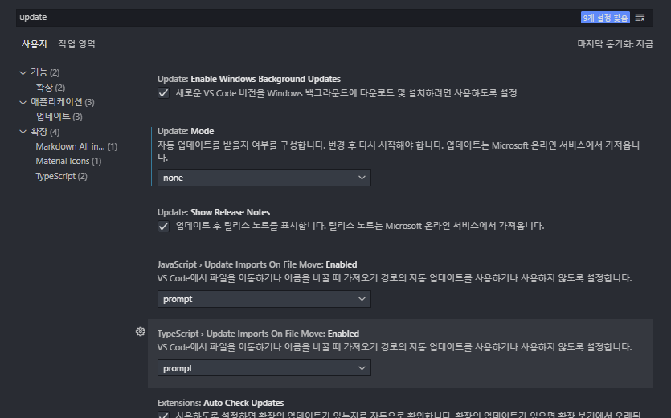
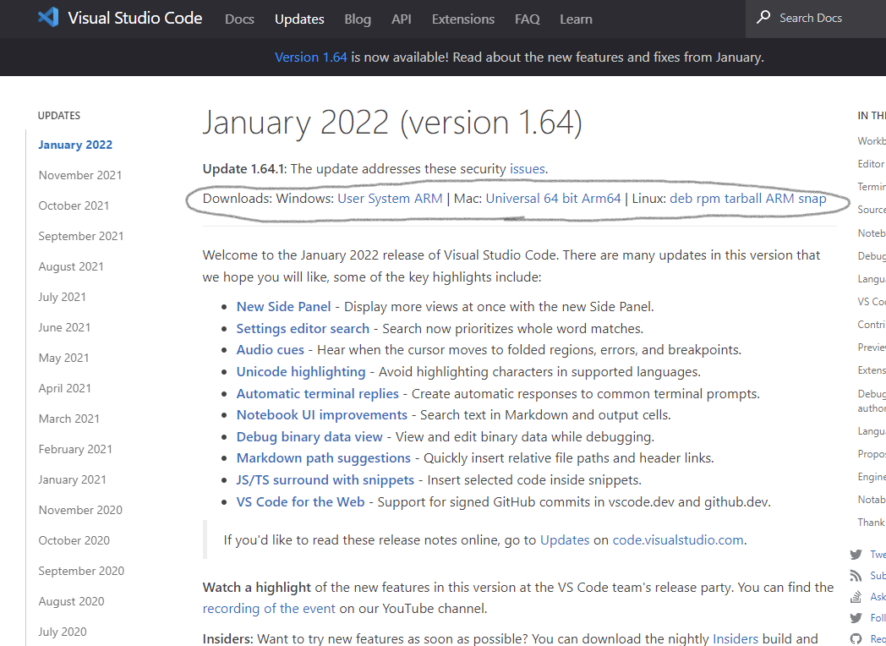
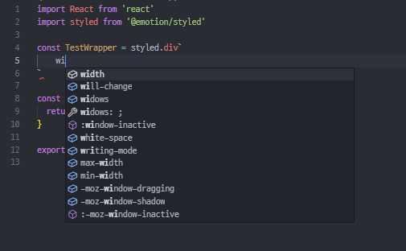

안녕하세요 오늘은 vscode-styled-components extension 자동완성 버그 발생 원인과 해결 방안에 대해서 알아보겠습니다.

# 문제 발생

어느 날 갑자기 컴퓨터를 켜서 작업하려고 하니 styled-component 자동완성이 안되는 문제가 발생했습니다.

# 해결 방안 찾기

나와 같은 문제가 발생한 여러 글을 읽어봤지만

해결 방법은 VSC 버전이 최신 버전이 아니라는 말이었고 나 같은 경우에는 이미 최신 버전이였기에 다른 방법을 찾아볼 수밖에 없었다.

하지만 이로 인해 얻을 수 있던 힌트는 VSC 버전과 vscode-styled-components extension의 버전이 맞지 않으면 오작동 할 수 있겠다고 생각했고
어제까지만 해도 작동했던 것으로 보아 VSC 가 자동 업데이트되면서 문제가 발생한 거 같습니다.

# 해결 방법

먼저 VSC 다운그레이드를 할 경우 자동 업데이트되는 것을 방지하기 위해 아래와 같이 변경해 줍니다.

(파일 > 기본 설정 > 설정) 들어가서 자동 업데이트 여부를 none으로 변경

### 페이지 접속

https://code.visualstudio.com/updates

페이지 접속 후 현재 버전 보다 한 단계 낮은 버전을 다운로드해줍니다.

### 해결

다운그레이드 후 VSC 재실행 시 자동완성이 정상적으로 실행된다면 성공 :)

---

# 참고 자료

- [Intellisense not working #347](https://github.com/styled-components/vscode-styled-components/issues/347)
- [How to downgrade vscode](https://stackoverflow.com/questions/49346733/how-to-downgrade-vscode)
