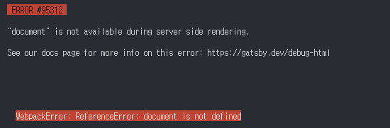

# 문제 발생

Gatsby 개발 블로그를 작업을 거의 다 끝내 처음으로 `yarn build`를 하고 나니 "document is not defined" 에러가 발생습니다.

Gatsby를 사용하면서 위와 같은 오류가 나는 이유와 해결 방법에 대해서 소개하려고 합니다.



# 문제 발생 원인

Gatsby의 같은 경우에는 두 가지의 다른 환경에서 애플리케이션 실행이 가능합니다.

- `gatsby develop` : runtime

- `gatsby build` : Build time

보편적으로 `gatsby build`를 사용할 때 이런 오류가 발생하는데 그 이유에 대해서 알아보겠습니다.

### Build time vs runtime

사용자가 누르고 클릭할 수 있는 상호작용이 가능한 웹 브라우저에서 발생하는 프로세스를 Browser runtime이라고 하는데
`Javascript` 코드의 경우 브라우저와 상호작용할 수 있고 window.location과 같은 Browser API를 사용할 수 있습니다.

반대로 Build time은 서버 프로세스를 사용하여 **웹 사이트를 파일로 컴파일하여 나중에 웹 브라우저로 전달할 수 있도록 하는 과정**을 의미하므로 이때는 window와 같은 Browser API를 사용할 수가 없습니다.

`gatsby develop` 커맨드의 경우 `gatsby build` 커맨드가 수행하는 빌드 단계 중 일부를 수행하지 않습니다.
대신 runtime처럼 브라우저에서 **사이트를 미리 보는데 사용할 수 있는 개발 서버**를 사용합니다.

`gatsby build` 커맨드의 경우 브라우저를 사용할 수 없으므로 코드에서 Browser API에 대한 호출을 할 경우 예외 처리해야 합니다.

# 해결방법

위와 같은 문제의 해결 방법으로는 2가지가 있습니다.

1. `doucment` 및 `window`가 정의되어 있는지를 확인 후 사용하기

```javascript
if (typeof document === 'undefined') {
  const temp = document.getElementById(id)
}
```

2. useEffect 함수 안에 넣어 사용하기

`useEffect` 및 `componentDidMount`처럼 생명주기의 경우 브라우저가 있지 않으면 코드가 실행되지 않습니다.

```javascript
useEffect(() => {
  const temp = document.getElementById(id)
}, [])
```

---

# 참고 자료

- [Debugging HTML Builds](https://www.gatsbyjs.com/docs/debugging-html-builds/)
- [Gatsby - the window is not defined error, what and how to fix it?](https://blog.greenroots.info/gatsby-the-window-is-not-defined-error-what-and-how-to-fix-it)
- [Overview of the Gatsby Build Process](https://www.gatsbyjs.com/docs/conceptual/overview-of-the-gatsby-build-process/)
