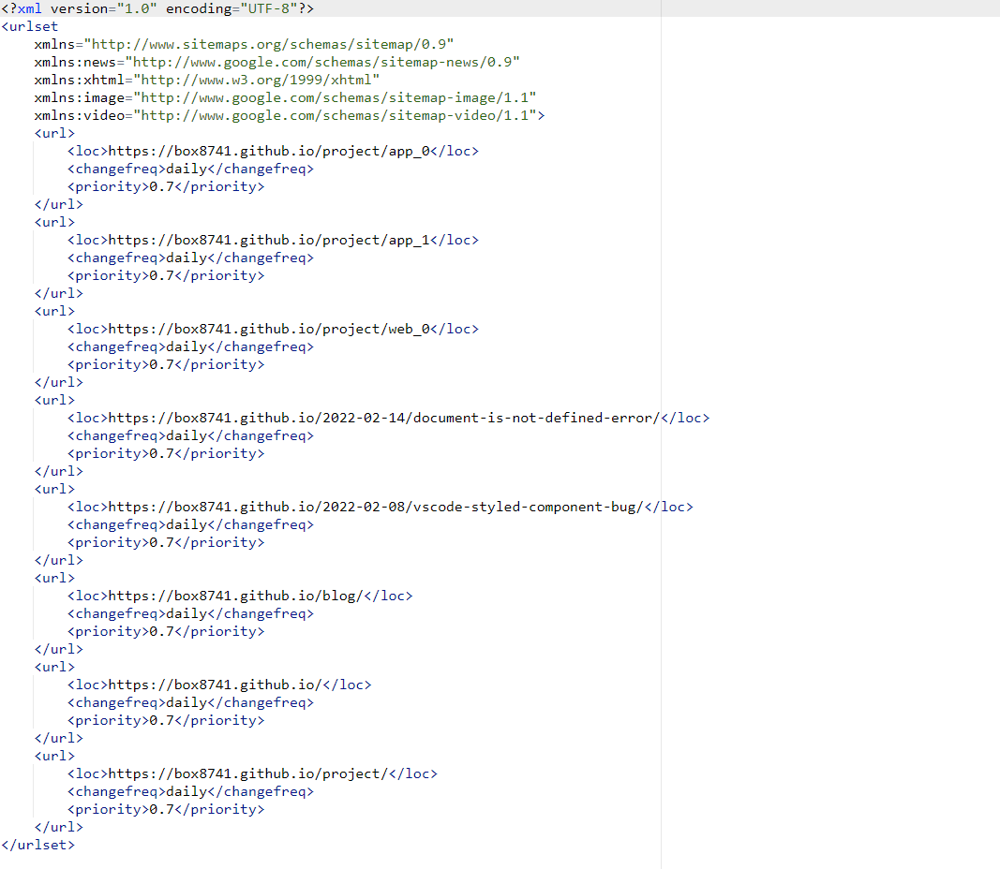
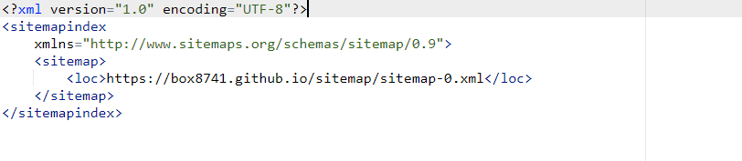

# 사이트맵이란?

사이트맵이란 사이트에 있는 페이지, 동영상 및 기타 파일등 그 관계에 관한 정보를 제공하는 파일입니다.

쉽게 말해 사용자들이 방문할 수 있는 페이지의 목록을 나타낸 것처럼 홈페이지의 설계도와 같은 것입니다.

대부분의 여러 검색엔진이 크롤링 할 수 있도록 `Sitemap`을 제출하도록 하고 있습니다.

개발자는 내가 사이트에서 중요하다고 생각하는 페이지와 파일을 알리고 중요한 관련 정보를 제공함으로써 더 효율적으로 크롤링이 가능합니다.

# Gatsby sitemap 라이브러리 세팅

프로젝트 빌드 시 생성되는 페이지에 `Sitemap`을 추가해 주는 라이브러리를 사용하겠습니다.

```
npm install gatsby-plugin-sitemap
```

또는

```
yarn add gatsby-plugin-sitemap
```

해당 라이브러리를 설치한 후 `gatsby-config.js`에 플러그인을 등록해 줍니다.

```js
siteMetadata: {
  ...,
  siteUrl: `https://www.example.com`,
},
plugins: [
  ...,
  `gatsby-plugin-sitemap`
]
```

작성 완료했다면 프로젝트를 빌드 하여 `Sitemap` 잘 생성되는지 확인해 봅니다.

```
yarn build
```

빌드가 정상적으로 완료되면 새로 생성된 `public/sitemap/sitemap-0.xml` 파일이 생성됐는지 확인해 줍니다.



사이트맵 폴더를 보면 `sitemap-index.xml`, `sitemap-0.xml` 파일 두 개가 있는데 `sitemap-index.xml` 파일을 잘 보면 따로 만들어졌던 `sitemap-0.xml` 파일을 참조하고 있습니다.



이런 식으로 사이트맵을 구성하는 이유는 사이트맵이 보유할 수 있는 데이터의 양에 제한이 있기 때문에 URL이 약 50,000 이상인 경우 여러 사이트맵을 만든 다음 하나의 사이트맵으로 참조하도록 하는 것입니다.

그래서 이를 해결하기 위해 모든 URL을 나눈 후 나눠진 개수만큼 `sitemap-0.xml`, `sitemap-1.xml`, `...`으로 사이트맵을 생성하는 것입니다.

그리고 이렇게 생성된 사이트맵들은 모두 `sitemap-index.xml` 파일에서 참조하도록 되어있습니다.

다만 일부 사이트에서는 이를 방지하고자 카테고리에 따라 분리하기도 합니다.

# 마치며

사실 대규모 프로젝트가 아닌 이상 굳이 사이트맵을 나눌 필요가 없지 않을까 이런 생각이 들긴 합니다.

---

# 참고 자료

- [사이트맵이란?(sitemap)](https://cockloft.tistory.com/104)
- [사이트맵 알아보기](https://developers.google.com/search/docs/advanced/sitemaps/overview?hl=ko)
- [gatsby-plugin-sitemap](https://www.gatsbyjs.com/plugins/gatsby-plugin-sitemap/)
- [Difference between Sitemaps and Sitemaps index?](https://support.google.com/webmasters/thread/76418206/difference-between-sitemaps-and-sitemaps-index?hl=en)
